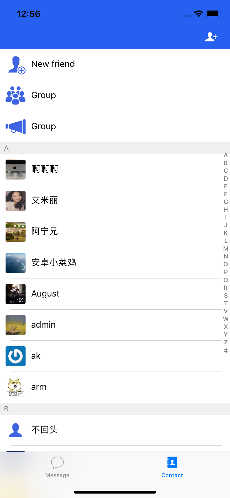

## 野火IM解决方案

野火IM是专业级即时通讯和实时音视频整体解决方案，由北京野火无限网络科技有限公司维护和支持。

主要特性有：私有部署安全可靠，性能强大，功能齐全，全平台支持，开源率高，部署运维简单，二次开发友好，方便与第三方系统对接或者嵌入现有系统中。详细情况请参考[在线文档](https://docs.wildfirechat.cn)。

主要包括一下项目：

| [GitHub仓库地址(主站)](https://github.com/wildfirechat)      | [码云仓库地址(镜像)](https://gitee.com/wfchat)        | 说明                                                                                      | 备注                                           |
| ------------------------------------------------------------ | ----------------------------------------------------- | ----------------------------------------------------------------------------------------- | ---------------------------------------------- |
| [android-chat](https://github.com/wildfirechat/android-chat) | [android-chat](https://gitee.com/wfchat/android-chat) | 野火IM Android SDK源码和App源码                                                           | 可以很方便地进行二次开发，或集成到现有应用当中 |
| [ios-chat](https://github.com/wildfirechat/ios-chat)         | [ios-chat](https://gitee.com/wfchat/ios-chat)         | 野火IM iOS SDK源码和App源码                                                               | 可以很方便地进行二次开发，或集成到现有应用当中 |
| [pc-chat](https://github.com/wildfirechat/pc-chat)           | [pc-chat](https://gitee.com/wfchat/pc-chat)           | 基于[Electron](https://electronjs.org/)开发的PC平台应用                                   |                                                |
| [web-chat](https://github.com/wildfirechat/web-chat)         | [web-chat](https://gitee.com/wfchat/web-chat)         | Web平台的Demo, [体验地址](http://web.wildfirechat.cn)                                     |                                                |
| [wx-chat](https://github.com/wildfirechat/wx-chat)           | [wx-chat](https://gitee.com/wfchat/wx-chat)           | 微信小程序平台的Demo                                                                      |                                                |
| [server](https://github.com/wildfirechat/server)             | [server](https://gitee.com/wfchat/server)             | IM server                                                                                 |                                                |
| [app server](https://github.com/wildfirechat/app_server)     | [app server](https://gitee.com/wfchat/app_server)     | 应用服务端                                                                                |                                                |
| [robot_server](https://github.com/wildfirechat/robot_server) | [robot_server](https://gitee.com/wfchat/robot_server) | 机器人服务端                                                                              |                                                |
| [push_server](https://github.com/wildfirechat/push_server)   | [push_server](https://gitee.com/wfchat/push_server)   | 推送服务器                                                                                |                                                |
| [docs](https://github.com/wildfirechat/docs)                 | [docs](https://gitee.com/wfchat/docs)                 | 野火IM相关文档，包含设计、概念、开发、使用说明，[在线查看](https://docs.wildfirechat.cn/) |                                                |  |


本工程为Swift集成野火IM示例工程。如果您在使用swift语言集成野火IM的过程中遇到问题，可以对比本工程。

## 更新库文件
本工程的```Frameworkd```目录下放置有所有野火IM的依赖库和资源，您可以更新这些依赖库，使用您编译的版本。注意如果有新添加的动态库依赖，需要在```Embedded Binaries```加上动态库。

## 修改配置
找到```Config.swift```文件，修改其中的```Demo_APP_URL```和```IM_HOST```。如果您使用了非推荐的80端口或者更新ICE配置，请在代码中自行更换。

## 运行
点击XCode执行按钮，启动应用，在第一个界面上输入电话号码和```SuperCode```，点连接。启动之后界面如下：

1. 会话界面


2. 联系人界面

